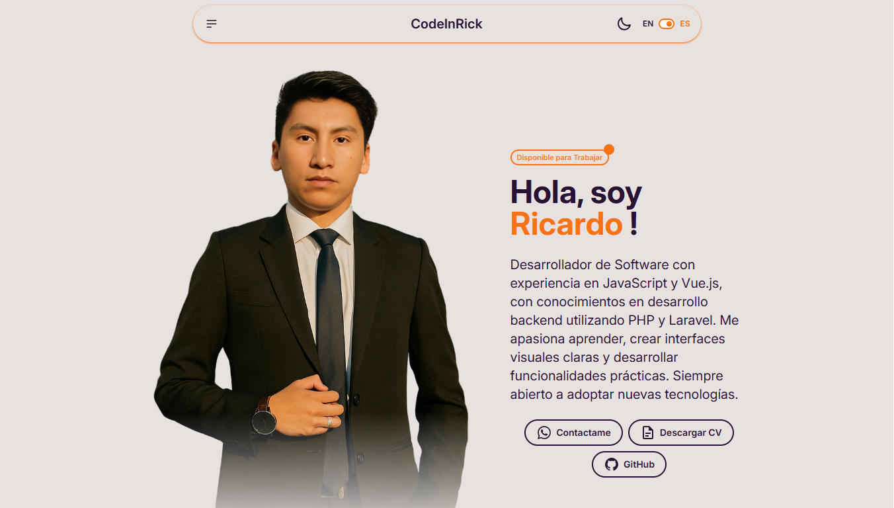
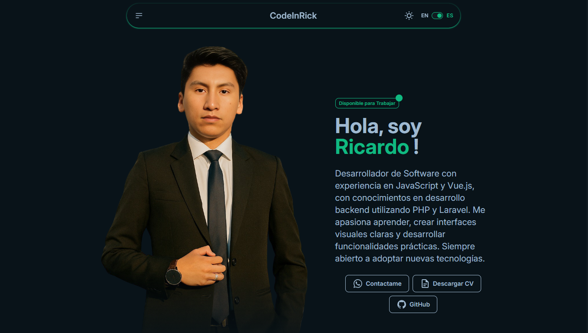

# 🚀 Portafolio Web - RickDev

🔗 **Visita mi portafolio en línea:**  
https://portafolio-dev-virid.vercel.app/

Este es mi portafolio personal desarrollado con **Vue 3** y **Vite**, donde muestro mis habilidades, proyectos y experiencia.  
El sitio es **totalmente responsive**, está disponible en **español e inglés**, y cuenta con soporte para **modo claro y oscuro**.


*Interfaz principal en modo claro mostrando secciones de proyectos y habilidades*


*Mismo diseño en modo oscuro con transiciones suaves entre temas*

---

## 🚀 Características

- 🌍 Multilenguaje: Español / Inglés  
- 🌗 Modo claro y oscuro  
- 📱 Diseño responsive para todos los dispositivos  
- ⚡ Desarrollado con Vite y Vue 3 (Composition API)  
- 🎨 Estilizado con Tailwind CSS + DaisyUI  
- 📧 Formulario de contacto con [FormSubmit](https://formsubmit.co/)  
- 🔥 Integración con Firebase mediante VueFire  
- 🎠 Animaciones suaves con vue3-marquee  
- 🔔 Alertas elegantes usando SweetAlert2  

---

## 🛠 Tecnologías Utilizadas

| Tecnología     | Función                            |
|----------------|-------------------------------------|
| `Vue 3`        | Framework principal del frontend    |
| `Vite`         | Herramienta de build                |
| `TailwindCSS`  | Estilos                             |
| `DaisyUI`      | Componentes para Tailwind           |
| `Iconify`      | Sistema de íconos                   |
| `vue-i18n`     | Internacionalización                |
| `VueFire`      | Integración con Firebase            |
| `vue3-marquee` | Efectos de texto animado            |
| `SweetAlert2`  | Modales de alerta                   |
| `Flowbite`*    | Componentes UI                      |
| `FormSubmit`*  | Servicio para enviar formularios    |

> *Se utilizan sin instalación local directa.

---

## 🧪 Instalación del Proyecto

```bash
# 1️⃣ Clonar el repositorio
git clone https://github.com/rick672/Portafolio-Dev.git

# 2️⃣ Entrar en el proyecto
cd Portafolio-Dev

# 3️⃣ Instalar dependencias
npm install

# 4️⃣ Ejecutar en modo desarrollo
npm run dev

# 5️⃣ Generar build para producción
npm run build

# 6️⃣ (Opcional) Previsualizar el build
npm run preview
